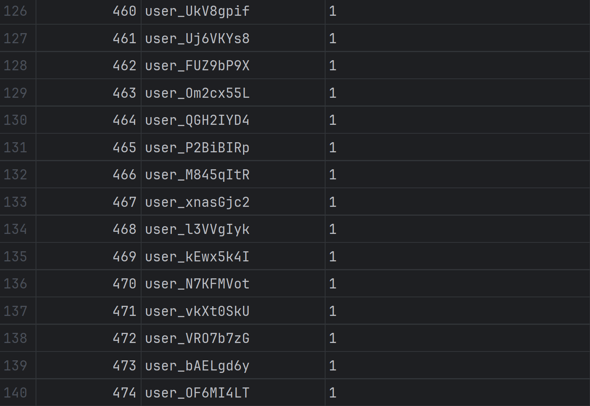
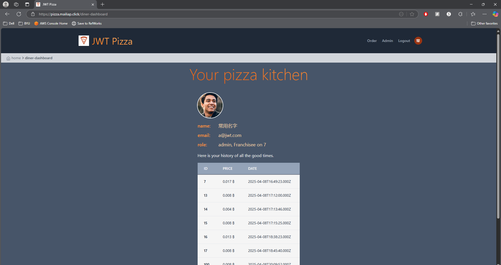
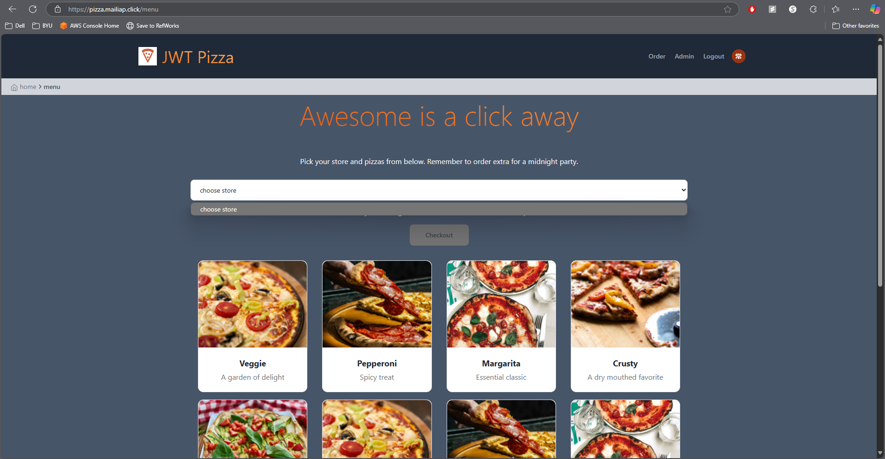
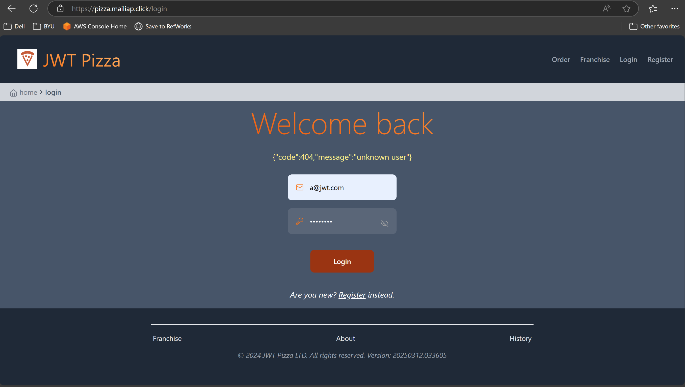

# Penetration Testing Report

**Caleb Calderwood and MaiLia Pōhahau**

## Self Attacks

### Caleb

#### Attack 1

| Item           | Result                                                                                                      |
| -------------- | ----------------------------------------------------------------------------------------------------------- |
| Date           | April 13, 2025                                                                                              |
| Target         | pizza.calebc48.click                                                                                        |
| Classification | Injection                                                                                                   |
| Severity       | 1                                                                                                           |
| Description    | Made a custom script to SQL injection to change all emails in the users table to 1                          |
| Images         |    All emails changed to 1.                              |
| Corrections    | Sanitize user inputs. I changed my update user function to use parameterized queries to prevent injections. |

### MaiLia

#### Attack 1

| Item           | Result                                                                                                                                                                                                                |
| -------------- | --------------------------------------------------------------------------------------------------------------------------------------------------------------------------------------------------------------------- |
| Date           | April 14, 2025                                                                                                                                                                                                        |
| Target         | pizza.mailiap.click                                                                                                                                                                                                   |
| Classification | Authentication Bypass                                                                                                                                                                                                 |
| Severity       | 2                                                                                                                                                                                                                     |
| Description    | Forged a JWT using jwt.io by modifying the payload and signing with a fake secret. Attempted to access an admin-only route using the forged token. The app did not verify the signature correctly and allowed access. |
| Images         |    Screenshot showing successful access to admin-dashboard with a fake token.                                                                               |
| Corrections    | Ensure JWT signatures are verified with the correct secret key. Reject unsigned or incorrectly signed tokens. Use a secure signing algorithm like RS256 if possible.                                                  |

## Peer Attacks

### Caleb Attacking MaiLia

#### Attack 1

| Item           | Result                                                                                          |
| -------------- | ----------------------------------------------------------------------------------------------- |
| Date           | April 15, 2025                                                                                  |
| Target         | pizza.mailiap.click                                                                             |
| Classification | Security Misconfiguration                                                                       |
| Severity       | 2                                                                                               |
| Description    | Found admin password due to default credentials, then changed the password with a custom script |
| Images         |    Logged in as admin.                           |
| Corrections    | Make admin credential more secure. Require frequent password changes.                           |

#### Attack 2

| Item           | Result                                                                                |
| -------------- | ------------------------------------------------------------------------------------- |
| Date           | April 15, 2025                                                                        |
| Target         | pizza.mailiap.click                                                                   |
| Classification | Security Misconfiguration                                                             |
| Severity       | 1                                                                                     |
| Description    | Used a custom script to delete stores from a franchise using acquired admin authtoken |
| Images         |    Stores are all deleted.                 |
| Corrections    | Make admin credential more secure. Require frequent password changes                  |

#### Attack 3

| Item           | Result                                                                                     |
| -------------- | ------------------------------------------------------------------------------------------ |
| Date           | April 15, 2025                                                                             |
| Target         | pizza.mailiap.click                                                                        |
| Classification | Injection                                                                                  |
| Severity       | 1                                                                                          |
| Description    | Made a custom script to use SQL injection to change all emails in the users table to 1     |
| Images         |    Can no longer login with previous email. |
| Corrections    | Sanitize user inputs.                                                                      |

### MaiLia Attacking Caleb

#### Attack 1

| Item           | Result                                                                                                                                                                       |
| -------------- | ---------------------------------------------------------------------------------------------------------------------------------------------------------------------------- |
| Date           | April 15, 2025                                                                                                                                                               |
| Target         | pizza.calebc48.click                                                                                                                                                         |
| Classification | Authentication Bypass                                                                                                                                                        |
| Severity       | 3                                                                                                                                                                            |
| Description    | Used jwt.io to forge a JWT with an "admin" role and signed it using a random secret. The forged token was accepted by the app, allowing full access to admin-only endpoints. |
| Images         |    Screenshot showing access to admin route using the forged token.                                            |
| Corrections    | Peer must implement proper JWT verification using the correct secret key and a secure algorithm                                                                              |

## Summary of Learnings

We both really enjoyed this deliverable, and we learned a lot of key information when handling code security. We learned about how SQL injections are very easy to use, but they are also easy to prevent. It is very important to sanitize information passed through requests to prevent this, or to handle the data in the backend in a way that does not leave your database vulnerable. We also learned how important JWT verification is. It was relatively easy to forge a JWT with falsified admin credentials, and the bad credential was accepted by the application. We also learned about the dangers of default credentials, and how those can be used to access confidential accounts and pages. There were a few ways we tried to attack that were unsuccessful, but those failures also helped to increase our overall knowledge of our systems. Overall, we both really enjoyed learning where our system was weak in our self-attack and then using that information to exploit the other person's site. This experience taught us how the best way to protect your system is to know how you can break it.
