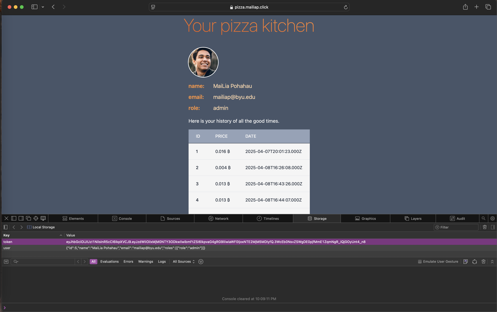
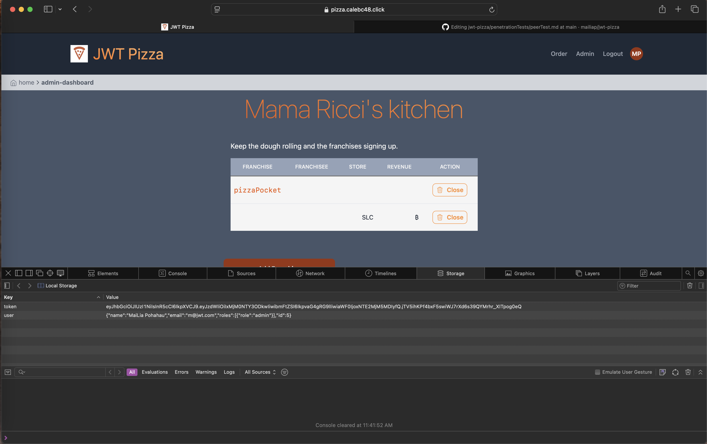

# Penetration Testing Report

**Caleb Calderwood and MaiLia Pōhahau**

## Self Attacks

### Caleb

#### Attack 1

| Item           | Result                                                                         |
| -------------- | ------------------------------------------------------------------------------ |
| Date           | June 18, 2053                                                                  |
| Target         | pizza.byucsstudent.click                                                       |
| Classification | Injection                                                                      |
| Severity       | 1                                                                              |
| Description    | SQL injection deleted database. All application data destroyed.                |
| Images         |    Stores and menu no longer accessible. |
| Corrections    | Sanitize user inputs.                                                          |

### MaiLia

#### Attack 1

| Item           | Result                                                                         |
| -------------- | ------------------------------------------------------------------------------ |
| Date           | April 14, 2025                                                                  |
| Target         | pizza.mailiap.click                                                       |
| Classification | Authentication Bypass                                                                      |
| Severity       | 2                                                                              |
| Description    | Forged a JWT using jwt.io by modifying the payload and signing with a fake secret. Attempted to access an admin-only route using the forged token. The app did not verify the signature correctly and allowed access.               |
| Images         |    Screenshot showing successful access to admin-dashboard with a fake token. |
| Corrections    | Ensure JWT signatures are verified with the correct secret key. Reject unsigned or incorrectly signed tokens. Use a secure signing algorithm like RS256 if possible.
## Peer Attacks

### Caleb Attacking MaiLia

#### Attack 1

| Item           | Result                                                                         |
| -------------- | ------------------------------------------------------------------------------ |
| Date           | June 18, 2053                                                                  |
| Target         | pizza.byucsstudent.click                                                       |
| Classification | Injection                                                                      |
| Severity       | 1                                                                              |
| Description    | SQL injection deleted database. All application data destroyed.                |
| Images         |    Stores and menu no longer accessible. |
| Corrections    | Sanitize user inputs.                                                          |

### MaiLia Attacking Caleb

#### Attack 1

| Item           | Result                                                                         |
| -------------- | ------------------------------------------------------------------------------ |
| Date           | April 15, 2025                                                                 |
| Target         | pizza.calebc48.click                                                           |
| Classification | Authentication Bypass                                                          |
| Severity       | 3                                                                              |
| Description    | Used jwt.io to forge a JWT with an "admin" role and signed it using a random secret. The forged token was accepted by the app, allowing full access to admin-only endpoints.   |
| Images         |    Screenshot showing access to admin route using the forged token.|
| Corrections    | Peer must implement proper JWT verification using the correct secret key and a secure algorithm                                                          |

## Summary of Learnings

- JWT signature verification is crucial
- Sanitize database inputs
